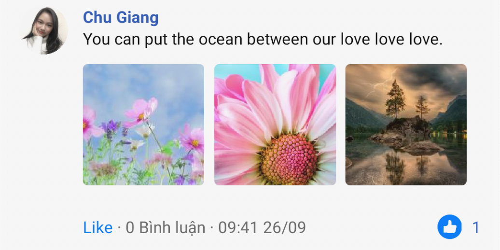
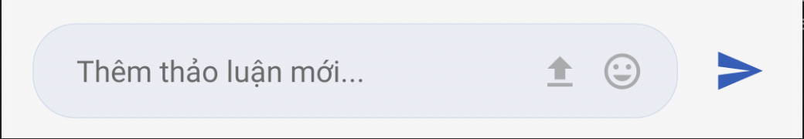

# Base Post

Post & Comment package for Base's projects.

### Add peer dependencies packages to your package.json

    "he": "^1.2.0",
    "react-native-iphone-x-helper": "^1.2.0",
    "lodash": "^4.17.15",
    "react-native-modal": "^11.4.0",
    "styled-components": "^4.4.0",
    "typesafe-actions": "^4.4.2",
    "linkifyjs": "^2.1.8",
    "react-native-render-html": "^4.1.2",
    "reselect": "^4.0.0"

## Installation

Require `@base/core` `he`

Add `"@base/post": ""` to `dependencies` in your `package.json`

Run `yarn install`

### If your project uses redux

Simply add our reducers to your rootReducer.

Our reducers located here: `@base/post/store/rootReducers`

### If your project doesn't use redux

Setup `@base/core` first.

In your `index.js`, insert:

```typescript jsx
import setup from "@base/post/store/setup";
setup();
```

### Setup languages

Setup your project languages options just like this:

```typescript jsx
import { enLang, viLang } from "@base/post";
const setUpLanguageOptions = {
  resources: {
    en: {
      translation: {
        ...enLang,
        ...yourLanguageObject,
      },
    },
    vi: {
      translation: {
        ...viLang,
        ...yourLanguageObject,
      },
    },
  },
};
```

## API References

### Hooks

There're 4 hooks:

`usePost`, `usePosts`, `useComments`, `useComment`.

You know what to do.

### Components

Every components below is compatible for both Post and Comments.

#### **Props**

Just check its types, you know what to do.

But remember, the `loadPostsFn`, `loadMoreFn`,... MUST return a Promise

#### Post



#### Posts


```typescript jsx
<Posts
  posts={posts}
  loadPostsFn={fetchPosts}
  loadMoreFn={fetchPosts}
  postReactionFn={reactFn}
  deletePostFn={deletePostFn}
  editPostFn={editPostFn}
  onPostPress={onPostPress}
  pressCommentsFn={pressCommentsFn}
/>
```

Simply render posts or comments (by using `Array.prototype.map`). Usually use inside a detail page.

#### PostList

Just like `Posts` component, but its render by using FlatList, usually use inside a modal.

#### InsertPost

Render a insert post view.



```typescript jsx
<InsertPost submitPostFn={submitPostFn} type={"post"} />
```

the `type` prop to determine if this component is use for post or comments

(a post allow multiple file upload, but comment doesnt);

#### PostListModal

Full screen PostList, with header.


